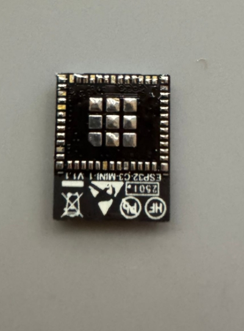
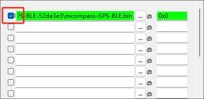

# 制作

## 源码
[Github](https://github.com/chaosgoo/mcompass)

## 模型
[MakerWorld CN](https://makerworld.com.cn/zh/models/667420#profileId-611642)

## PCB

[PCB工程文件和面板](https://oshwhub.com/chaosgoo/wcompass)

## 材料补充说明
* PCB板厚选择1.0mm, 黑色阻焊, 嘉立创制作;
* 面板立创商城制作, 参数选择1.0mm 半透黑色亚克力强遮光,无需背胶, 后续借助胶水胶合;
* 匀光材料选择PET LGT075J, 无需背胶, 后续借助胶水胶合;
* 电池参数 213455 500MAH
* 滚花螺母 M2*3*3.2
* 螺丝 M2*4 内六角
* GPS ATGM336H 5N71模块+天线, 尺寸13.1mmx15.7mm

## Q&A
### 2024年12月02日

**Q**: GPS定位需要多久

**A**: 根据淘宝介绍页面和实测, 首次定位需要30秒+

**Q**: 根据[项目原理图](https://oshwhub.com/chaosgoo/wcompass)的灯珠手册描述, 工作电压应为3.5V~5.5V, 而原理图中实际使用LDO 3.3V输出作为电源

**A**: 设计失误, 从实际工作情况来看, 还没有表现出什么严重问题. 如果后面有第二版计划,会修复这里的设计.

### 2025年06月11日
**Q**: 制作完以后插电脑没反应

**A**: 
* 检查开关是否开启, 向上拨动为开启状态
* 检查ESP32-C3 是否焊接成功, 可将芯片拆下,背面朝上,检查是否有引脚未沾上锡
图片里的就是刚好D-没有锡导致无法连接电脑, 这种情况手动给模块补锡

* 检查LDO输出是否正常
* 检查灯珠是否有方向错误问题

**Q**: 制作完以后插电脑,打开设备管理器后一直刷新

**A**: 新的ESP32-C3没有固件情况下会一直报Flash错误, 会不断重启,所以丢失USB连接, 直接烧录即可

**Q**: 烧录没有反应

**A**: 请确认是否勾选了固件

**Q**: 灯珠从某个开始就不亮了

**A**: 检查最后一个亮的灯珠和第一个不亮的灯珠焊接